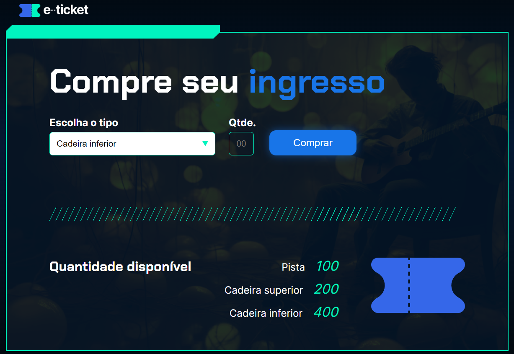

# Ingresso - Alura

Esta atividade foi desenvolvida durate o curso da Alura e consiste em um desafio onde foi proposto desenvolver utilizando functions e conceitos de DOM um programa para comprar ingressos, subtraindo dos valores mostrados na tela, os ingressos comprados. 
